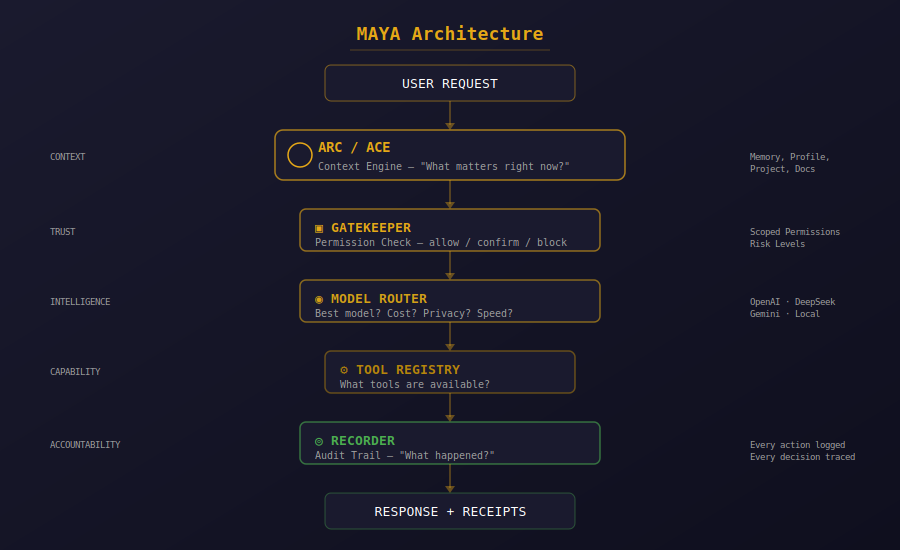

# MAYA

### The operating layer for AI that you can actually trust.

**MAYA is not an AI agent.** MAYA is the context-aware, permissioned operating layer that routes intelligence, enforces boundaries, and shows you exactly what happened — underneath any model or agent you choose to run.

---

## What MAYA Is

- **A permission layer you can see.** Every tool, every action, every model call — gated, logged, auditable. No black boxes.
- **A context engine that knows what matters.** ARC (Adaptive Relational Context) routes the right memory, profile, and project data to the right model at the right time — without dumping your entire life into every prompt.
- **A multi-model router.** OpenAI, DeepSeek, Gemini, local models — MAYA picks the right tool for the job based on cost, speed, privacy, and capability. You're not locked into anyone's ecosystem.
- **An audit trail that doesn't lie.** Recorder logs every action: what ran, when, why, and what happened. If something goes wrong, you know exactly where.

## What MAYA Is Not

- **Not a chatbot.** Chat is the surface, not the product. The product is what happens between messages — classification, routing, permission checks, context assembly, tool execution, audit logging.
- **Not a data moat.** We don't get smarter by harvesting your email, calendar, and docs. Your context is yours. Our moat is the trust layer.
- **Not vapor.** What you see here is running code. The Gatekeeper gates real tools. The Recorder produces real audit logs. The router switches between real providers. This isn't a whitepaper.

---

## Architecture

<p align="center">
  
</p>

Every request flows through the same spine. Nothing skips the Gatekeeper. Nothing escapes the Recorder. That's not a feature — that's the architecture.

---

## What's Real Today

| Component | Status | What It Does |
|---|---|---|
| **Gatekeeper** | ✅ Live | Permission engine — gates every tool/action by risk level |
| **Recorder** | ✅ Live | Audit trail — what ran, when, why, result |
| **Multi-Model Router** | ✅ Live | Routes tasks to OpenAI, DeepSeek, Gemini, or local models |
| **ARC Context Engine** | ✅ Live | Selects relevant context per request — memory, profile, project |
| **Property Management Demo** | ✅ Live | Inbound message → classify → draft → approve → receipt |
| **Cron Dashboard** | ✅ Live | Scheduled job management with suggestion detection |
| **Usage Dashboard** | ✅ Live | Live provider quota, cost tracking, model health |
| **Staff System** | ✅ Live | Specialist agents with defined roles, permissions, and output lanes |

---

## The Counter-Position

Every major platform is racing to ship AI agents:

- **Microsoft** has Scout
- **Google** has Gemini Spark  
- **Amazon** has Quick
- **Meta** has AI Business Agent
- **OpenAI** has Operator

All of them have the same business model: **your data is their moat.** They get smarter by reading your email, calendar, documents, and behavior — and the routing logic is invisible.

**MAYA's position is the inverse:** your context is yours. Our moat is the trust layer — permissions you can see, routing decisions you can audit, memory you can edit.

The market is already validating this. Gartner just created the "Guardian Agents" category for AI agent security and governance. Researchers are publishing papers on agent memory architectures that map directly onto what MAYA already does. The community is building budget controls and permission wrappers as aftermarket patches for agents that shipped without them.

MAYA was designed from the architecture up to solve this. Not as a patch. As the foundation.

---

## Why "MAYA"?

MAYA is named for Josh's late dog — a protective, loyal German Shepherd who watched over everyone she cared about. The product carries that ethos: intelligence that protects, context that remembers, boundaries that can't be bypassed. MAYA is protective intelligence.

---

## What's Coming

This is a **soft launch** — the architecture is real, the core surfaces are running, and we're opening the doors to show what we've built. Here's what's next:

- **Paid pilot** — Property management vertical, SMB operations focus
- **Business profiles** — Scoped permissions, role-based tool access  
- **Connector layer** — Email, SMS, calendar, CRM integration
- **Self-hosted option** — Run MAYA entirely on your own hardware

---

## Stay Connected

- **GitHub:** [github.com/MAYA-Platform/MAYA](https://github.com/MAYA-Platform/MAYA)
- **Built by:** [2ndNatureAI](https://github.com/2ndNatureAI)

---

*MAYA is protective intelligence. Not a black box. Not a data moat. An operating layer you can see, audit, and trust.*

---

## What's in This Repo

This is the public soft-launch of the MAYA architecture. It contains:

### Tools (`tools/`)

| Tool | What It Does |
|---|---|
| **Multi-Router** (`tools/multi-router/`) | Intent-aware model router — classifies tasks and recommends the best provider |
| **Provider Switch** (`tools/provider-switch/`) | One-click LLM/vision provider switching with fallback chains |
| **Usage Widget** (`tools/maya-usage-widget/`) | Live provider quota, cost tracking, and model health monitor |
| **Staff Tracker** (`tools/staff-tracker/`) | Visual agent status board for multi-agent systems |

### Assets (`assets/`)

- `architecture-diagram.svg` — The MAYA architecture spine: ARC → Gatekeeper → Router → Recorder
- `org-avatar.png` — 2ndNatureAI organization avatar

### Quick Start

```bash
pip install -r requirements.txt
python tools/multi-router/maya_multi_router.py
python tools/provider-switch/provider_switch.py
python tools/maya-usage-widget/maya_usage_widget.py
python tools/staff-tracker/staff_tracker.py
```

Each tool is a standalone Python desktop app (tkinter). Dark MAYA theme. No API keys included — bring your own.

---

## Stay Connected

- **GitHub:** [github.com/MAYA-Platform/MAYA](https://github.com/MAYA-Platform/MAYA)
- **Built by:** [2ndNatureAI](https://github.com/2ndNatureAI)
- **License:** MIT (see [LICENSE](LICENSE))

---

*MAYA is protective intelligence. Not a black box. Not a data moat. An operating layer you can see, audit, and trust.*
